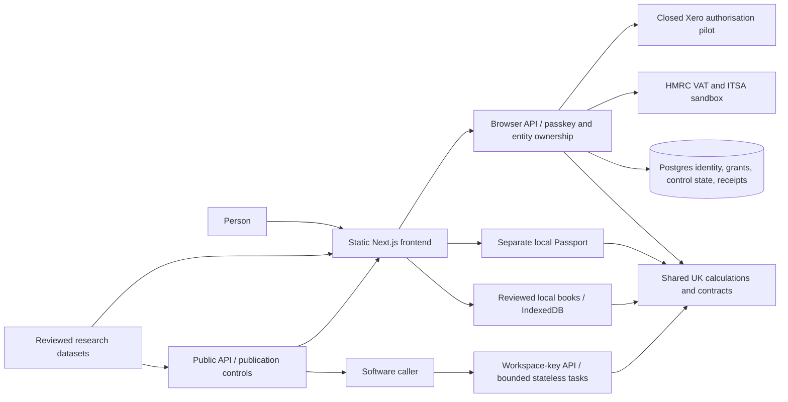
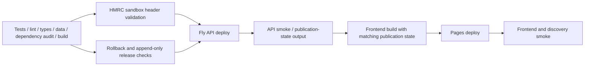

# TaxSorted architecture and production map

Inspected **2026-09-12**, starting from `25871cc1bde61b858ab89650692e52333f3f4f28`.
This is a repository and workflow audit with bounded local refactors, not approval to
file real returns, open provider access or publish restricted datasets.

Follow-up: [history consolidation](CONSOLIDATION.md) records the preserved local
commits and working baseline; [production gaps](PRODUCTION-GAPS.md) turns this
audit into actionable work packages. Verification below records the initial audit.
The [subsequent hardening batch](RELEASE-HARDENING-2026-09-12.md) records dependency,
source-review, Books recovery and browser-mutation changes; use its results when
assessing those gaps after the baseline audit.

## Finding

There is enough implemented architecture to develop the existing product into a
production service without a rewrite. The strongest current path is **reviewed local
books → derived Income Tax quarters → explicit sandbox approval → receipt**. The
next work is completing and proving that path, keeping VAT and provider ingestion
honest, and consolidating the modules around it.

There are three separate readiness questions:

- **Public/local preparation product:** already deployed, with useful Books, learning,
  planning and public-reference surfaces. It is intentionally limited in business,
  currency, tax-year and custody scope.
- **Clean reproducible release:** the static build works, but the current dependency
  audit fails the repository's release gate. An old successful deployment does not
  establish today's dependency status.
- **Production tax filing:** not established. Sandbox implementation, HMRC production
  recognition, current source review, durable submission handling and complete
  year-end/account/payment workflows are different requirements.

## Repository lineage and inspected perimeter

| Location | Evidence at start | Treatment |
| --- | --- | --- |
| Original `taxsorted.io` checkout | Local `main` at `d6f94ab`; 4 unique commits and 184 missing remote-main commits | Preserved. Its July code is not the current production baseline. |
| Remote `cambridgetcg/taxsorted.io` main | Fetched `25871cc`, dated September 4 | Baseline for this audit and refactor branch. |
| `taxsorted-rails` | Separate clone of the same repository; dirty artist-experience branch | Compared read-only. No merge, reset or deletion. |
| `taxsorted` | Archived pointer to the canonical repository | Editorial seeds already recovered into `content/seeds/`. |
| `taxsorted-architecture` | New worktree on `codex/architecture-map-20260912` | Contains this audit and the first bounded refactors. |

The four original local-only commits contain locale/trainer, Policy Watch, heartbeat
and creator-guild work. Divergent work is not an orphan-deletion list.

The baseline has three npm workspaces, **64 frontend page source entrypoints**, 96
tracked engine files, 145 API source files, 287 frontend source files, 137 research
files, 17 regulatory notes and 19 recovered page seeds. These are inventories, not
capability or coverage counts.

Observed outside the repository: the [public homepage](https://taxsorted.io/) exposes
the six current doors; `GET https://api.taxsorted.io/v1/health` returned
`hmrc.configured=true`, `hmrc.env=sandbox`. GitHub reports the September 4
[release run](https://github.com/cambridgetcg/taxsorted.io/actions/runs/33878648258)
succeeded for the baseline SHA. These observations align with the current source;
they do not prove every deployed byte or private switch. No authenticated live API
calls, database queries, provider connections, filing, deploys or messages were made.

## System map

`engine/` is intended to be the pure calculation/contract boundary. Its older HMRC
subtree still mixes browser collection and fetch transport with pure validation;
that is an explicit remaining exception, not a fully achieved architecture claim.

| Boundary | Current owners | Contract to preserve |
| --- | --- | --- |
| Routes and presentation | `frontend/src/app/`, shared components, new `features/books/` | Routes compose features; shared workspace implementation does not belong to one historical route. |
| Local record custody | `frontend/src/lib/records.ts`, `local-books.ts`, CSV/import/sync helpers | Confirmation, source history, separate businesses and IndexedDB transactions. Account sign-in does not back up books. |
| Portable understanding | `passport-store.ts`, engine `uk/expert/tax-position-passport.ts` | Facts and unknowns, separately saved local data; no cloud Passport upload. |
| Tax calculations | `engine/jurisdictions/uk/{itsa,personal,personal-tax,vat,sdlt,expert}` | Supported inputs, effective dates, units, sources and explicit limits. `personal-tax` delegates shared computation; it is not an independent duplicate engine. |
| Browser service | `api/src/app.ts`, `session.ts`, account/entity/HMRC routes | Only five allowlisted route trees create browser sessions. Recovery identity and full passkey identity remain different. |
| Machine service | `developer-api.ts`, API keys and task routes | Workspace-key identity does not imply browser-account or HMRC authority. |
| Public knowledge | `research/uk/*/data/`, `api/src/uk-*.ts`, public routes | Source/rights/review/publication gates; public reads do not create taxpayer cookies. |
| External adapters | `hmrc.ts`, `accounting-runtime.ts`, `accounting-xero.ts`, token vault | Connection, consent, imported coverage, review and permission to file are separate states. |
| Operations | `api/RUNBOOK.md`, migrations, Fly config, CI and release scripts | API first, verified publication state, frontend second; rollback targets and release-history continuity. |

## Follow the workflows

| Workflow | Current path | What still limits it |
| --- | --- | --- |
| Check and Plan | Six-door shell → bounded check/choice → facts, sources, unknowns | A scenario cannot silently become an accounting fact. MTD expert source review is overdue. |
| Books | Manual/CSV input → To check → confirm category/business scope → recorded local books → separate business totals | One supported trade and one property business; GBP and 2026–27 UI. No full restore, attachments, reconciliation or statutory accounts. |
| ITSA | Books → deliberate entity/business link → cumulative quarter totals → review → last-moment local revision/totals check → sandbox PUT → receipt | Year-end adjustments, other income, final declaration and account/payment follow-through are incomplete. More than one ledger of the same activity pauses quarter/estimate views. |
| VAT | Entity/VRN → separate VAT OAuth grant → HMRC obligation → manual nine-box form → validation/consent → sandbox POST → stored receipt | Books-to-VAT derivation is absent; submission durability and context-change behavior need work. |
| Account | Anonymous sandbox session → passkey registration/sign-in → account-owned entities → recovery-only or full identity | Sign-in protects server-side authority, not local book recovery or synchronization. |
| Passport | Explicit local save → versioned export/printable handoff | Evidence states are stated, not independently inspected; public schema/examples accept no private upload. |
| Provider ingestion | Synthetic adapter → fenced page → local commit → exact acknowledgement → complete-run checkpoint | Development proof. Closed Xero pilot adds OAuth, token custody and organisation binding, but advertises no financial datasets. |
| Public understanding | Research corpus → validation/review → publication decision → dataset/API/OpenAPI/guide | Schema-only and pending-review material must not be mistaken for available records. |

The actual Income Tax path already implements more safeguards than the older VAT
path. Reuse its design lessons; do not assume the two workflows are equivalent.

## Orphans, misplaced modules and intentional held work

The frontend audit followed relative and `@/` imports/re-exports from page, layout,
sitemap, robots and build-script entrypoints. Tests were not production roots. No
production dynamic imports/require/glob loader was found in the inspected frontend.
This is repository reachability; it cannot establish whether a public asset has an
external bookmark or whether an exported function has an out-of-repository user.

| Finding | Evidence | Disposition |
| --- | --- | --- |
| Old dashboard island | All nine files under `frontend/src/components/dashboard/` are unreachable from current production entrypoints. Current dashboard uses `dashboard-v2/`. | Quarantine/remove in a dedicated cleanup after confirming demo intent; retained here. |
| Test-only fixtures and types | `frontend/src/lib/mock-data.ts`, `frontend/src/types/dashboard.ts` have no current production path | Move fixtures under test support with their tests if retained. |
| Unused UI/module files | `components/ui/tooltip.tsx`, `components/vat/vat-wizard.tsx` unreachable; VAT connection/liability cards have barrel exports but no rendered consumers | Review as separate retirement candidates. |
| Starter assets | `public/{file,globe,next,vercel,window}.svg` have no frontend references | Safe candidates for a later asset cleanup, not evidence for deleting user content. |
| Old HMRC transport | Six exported direct-HMRC fetch functions in `engine/.../hmrc/vat-api.ts` have no current callers; server transport is `api/src/hmrc.ts` | First extract the pure return validator/totals contract and preserve compatibility exports. The whole file is not dead: its validation is active. |
| Shared Books screen under an ITSA route | Four Books routes imported `app/itsa/records/records-client.tsx` | Fixed: implementation and test now belong to `frontend/src/features/books/`; all five route wrappers use it. |
| Runtime assembly in executable entrypoint | `api/src/index.ts` combined route composition, DB migration and listening | Fixed: `createApp()` in `app.ts`; minimal bootstrap in `index.ts`. |
| Smoke programs inside YAML | 2,147 lines of command bodies embedded in deployment steps | Fixed: exact bodies extracted into `scripts/release/smoke-api.sh` and `smoke-frontend.sh`. Workflow reduced from 2,655 to 509 lines. |
| Standalone prototype | `tax-tricks.html` has no tracked text references and is outside static output | Archive candidate; retained, not promoted as reviewed guidance. |
| Recovered page seeds | 19 pages under `content/seeds/`; only four have equivalent current route paths | Editorial backlog with explicit stale 2024/25 figures; not publishable code. |
| Candidate research | Accountability zero-row contracts and professional-opportunity review material | Intentional publication boundaries, not dead code. |
| Research datasets | Direct imports/reads, validators and Docker allowlist | Production resources under a misleadingly broad folder name; retain paths until a tested resource interface replaces direct coupling. |

There are **13 unreachable frontend TS/TSX files**, plus the two unused card modules
and five starter assets above. No orphan candidates were deleted.

## Concrete production gaps

These findings separate observed code from unverified runtime consequences.

1. **The current dependency gate fails.** `npm audit --omit=dev --json` reports
   seven affected dependency entries: one critical, one high and five moderate.
   Next is pinned to 16.2.11, sharp is overridden to 0.35.3, and Hono to 4.12.34.
   The advisory feed proposes newer fixes; apply reviewed compatible upgrades in a
   separate lockfile change and rerun the complete gate. Do not use a forced mass fix.
   [Next's Windows-server advisory](https://github.com/advisories/GHSA-p293-qw3h-jr36)
   and [image-optimizer advisory](https://github.com/advisories/GHSA-2xp9-vwfh-vxw4)
   have runtime conditions that differ from this static Pages export with image
   optimization disabled. This audit establishes a release-gate failure, not a
   demonstrated exploit against the hosted site. See also the
   [sharp advisory](https://github.com/advisories/GHSA-rgj7-g3m4-5g8c).

2. **MTD source freshness is a real capability stop.**
   `engine/jurisdictions/uk/expert/mtd-income-tax.ts` sets `reviewDueOn` to
   2026-08-11 and returns `source_review_required` after that date. The release
   canary explicitly accepts this honest degraded state. Review primary sources and
   update evidence, reasoning/tests and review dates together; changing the date
   alone would erase the guard. Passing corpus-shape validation is not source renewal.

3. **VAT cannot guarantee a durable filing outcome.**
   `api/src/routes/vat.ts` checks for an existing receipt, calls HMRC, then inserts
   the receipt. Two calls may pass the check before either inserts; a provider
   success followed by a DB failure can leave no local receipt. The unique constraint
   protects rows after the external action. Add a persisted submission intent,
   immutable approved payload, outcome-unknown state and reconciliation before live
   filing. The code-order finding is confirmed; no real duplicate return was sent.

4. **HMRC connection lifecycle lacks the newer connector's fences.**
   `api/src/hmrc.ts` refreshes/upserts tokens without a generation fence; disconnect
   in `routes/connect.ts` revokes upstream then deletes locally. A concurrent refresh
   can race that deletion. Connection reads key by entity/rail while upstream host
   follows the global environment. Environment/VRN changes therefore need explicit
   custody and migration rules. Use adversarial lifecycle tests before extracting a
   shared adapter; do not mechanically reuse Xero's provider-specific behavior.

5. **Mutation protection and validation deserve a focused security pass.** Account
   and accounting mutation routes require an allowlisted Origin; entity writes, VAT
   submission and HMRC disconnect lack that equivalent check. CORS alone does not
   establish that protection. Separately, the pure VAT validator's decimal/finite
   checks are narrower than its comments; API Zod guards some cases but is not proof
   of the pure exported contract. These are code findings, not exploit attempts.

6. **The VAT UI still has context and uncertainty seams.** Its form retains initial
   `periodKey` state while entity/period query context may change. The failed-submit
   title says "Not filed" even where delivery might be unknown. Reproduce with
   controlled delayed responses and test cancellation, exact review context and
   ambiguous outcomes before changing the filing state machine. The `/file` hub's
   false claim that VAT already derives from Books has been corrected here.

7. **Local-book recovery and accounting completeness are unfinished.** Exports
   exist; a complete backup restore operation is absent from `RecordsStore`.
   Combined-business record splitting, additional ledgers per activity, attachment
   custody, reconciliation and double-entry/accounts need independent contracts.
   They should not be implied by a connected provider or account login.

8. **Production filing has external and operational gates.** The repository's
   runbook still names HMRC approval, recovery-policy work, security assurance,
   privacy operations and edge rate limiting, alongside missing tax workflow stages.
   These are recorded project gaps; this audit did not inspect private approval
   records, production edge rules or commission a legal/security assessment.

## Next module boundaries

Keep the three workspaces. Prefer internal modules over adding packages merely to
redistribute files. A productive extraction order is:

| Next extraction | Why | Acceptance evidence |
| --- | --- | --- |
| Pure VAT return contract, separate browser HMRC collection and server transport | Engine currently imports pure functions from a fetch-capable module | Existing VAT cases, precision/nonfinite edge cases, unchanged exports and browser bundle inspection |
| HMRC connection lifecycle and submission service | Authority and external side effects need explicit state, not just smaller files | Real Postgres concurrency tests plus provider stubs covering refresh/disconnect, duplicate attempts and accepted-but-unsaved outcomes |
| `developer-api.ts` by existing domain registration functions | 7,578 lines mix schemas, route registration, guards and document slicing | OpenAPI schema/reference/operation-ID tests, unchanged session boundaries and exact public contracts |
| Books persistence/import/sync services below the feature | `records.ts` is 1,511 lines; transaction and review semantics span several concerns | Import/review invariants, schema migration, export/restore, interrupted commit and business-isolation tests |
| Dataset resource interface | Runtime JSON paths are coupled across API, frontend, Docker and validators | Same admitted bytes/hashes, rights, publication state and deployment content |
| Runbooks by operational responsibility | 1,813 lines mix HMRC, public data, keys and Xero incident work | Central index and stable links; no lost recovery/stop procedure |

The 1,948-line accounting service and 2,558-line Xero adapter are also substantial,
but their custody/state transitions should be understood before mass moves.

## Release workflow

Both `.github/workflows/ci.yml` and `deploy.yml` run checks on pull requests. Their
build-gate environments differ, so consolidate only after checking required branch
checks and intended publication-state coverage. No CI trigger or protection was
removed in this pass. The local `frontend` deploy command remains a manual path;
the documented API-first release workflow should be the standard production path.

## Work completed and verification

The first patch isolates Books, separates API construction from process startup,
extracts the release smoke programs without changing their commands, corrects the
VAT capability description and repairs the current documentation reading path.
The docs index distinguishes historical plans, current contracts, runtime resources
and candidate material. Tax math, schemas, storage migrations, credentials and
publication switches are unchanged.

| Check | Result |
| --- | --- |
| Full suite on Node 22.23.2 / Vitest 4.1.10 | **2,001 passed, one existing todo** across 201 test files: engine 386, frontend 629, API 986. Passport schema snapshot check passed. |
| Frontend ESLint | Passed. |
| All workspace typechecks | Passed; Node 22 build also completed its frontend TypeScript check. |
| `npm run validate:learn` | Passed. Professional-opportunity review remains explicitly `pending`, with hosted distribution not approved; this validator allows that closed state. |
| Node 22 production static build | Passed; 73 generated static pages. Postbuild publication worker generated in the closed state. |
| Release extraction | Both shell command bodies compare byte-for-byte with the original YAML blocks; independent review confirmed env, outputs, cwd and order. Both pass `bash -n`; workflow YAML parses. |
| Documentation links / diff whitespace | Local documentation targets exist; `git diff --check` passed. |
| Production dependency audit | **Failed:** seven affected entries, including critical Next and high sharp entries. Dependencies unchanged in this refactor. |

The 20 new assembled-app tests exercise real routers and session middleware with
stubbed SQL, listener and fetch under a fixed production configuration with Xero
disabled. They establish sampled routing and cookie boundaries, not live Postgres,
WebAuthn, HMRC, Xero or bootstrap-migration behavior. Provider/concurrency tests in
the wider suite likewise do not replace real database/provider integration proof.

The full run exposed an existing Books test timing assumption: waiting for the static
page heading did not mean IndexedDB had opened. Those assertions now await the actual
loaded control or empty state; no sleep or product behavior change was added. An
earlier test run overlapped file moves and was discarded; the final complete run was
green. Local tsx validators needed permission to open their temporary IPC sockets
outside the sandbox. Node 22 was fetched into npm's cache; global Node was unchanged.

The build still warns that a parent-directory lockfile influences Next's inferred
workspace root. Set the tracing root explicitly in a follow-up; do not remove the
user's unrelated home lockfile. This warning did not prevent the static export.

Live smoke scripts were not executed: they contain authenticated synthetic
calculation requests and belong to an authorised release. At the end of the initial
audit the changes were uncommitted; the subsequent consolidation commits them and
aligns local main as described in `CONSOLIDATION.md`. No changes were pushed or
deployed. The original local-only commits remain recoverable and the artist worktree
is unchanged.

## Recommended build sequence

1. Restore a green release gate with reviewed dependency updates and genuine source
   renewal. Keep the existing source-review stop and all publication gates.
2. Prove the local preparation release: supported businesses, export/restore,
   context switching, record confirmation and source trails. This is a useful product
   independently of production filing.
3. Harden HMRC authority and submission lifecycle with durable intents, environment
   isolation, explicit unknown outcomes, reconciliation and origin protections.
4. Complete the Income Tax year-end/account/payment journey and the separate
   reviewed-books-to-VAT derivation. Gate each supported regime independently.
5. Complete one read-only provider financial import through To check and
   reconciliation. OAuth success alone is not completion. Expand providers only
   after that shared contract is proved.
6. Resolve the recorded recognition and operational requirements before enabling
   production filing. Open additional public corpora only through their own existing
   review and publication process.
